# TryHackMe - Silent Monitor Write-Up

**Category:** Web Exploitation / Privilege Escalation

---

## Overview

Enumerated a CorpNet "Network Operations Centre" portal running on a non-standard port, bypassed its login form with a classic SQL injection, and rode the resulting operator session into an authenticated command injection in the host-health probe feature. That RCE surfaced plaintext credentials in a leftover config file, which unlocked SSH as `sysadmin`. From there, a KeePass database sitting in a backup directory cracked offline with John the Ripper, and the credentials inside it gave up the root password directly.

---

## Reconnaissance

### Nmap Scan

I started with a verbose service scan to get results streaming in as they're found, rather than waiting on a full run.

```bash
nmap -sV -v <target-ip>
```

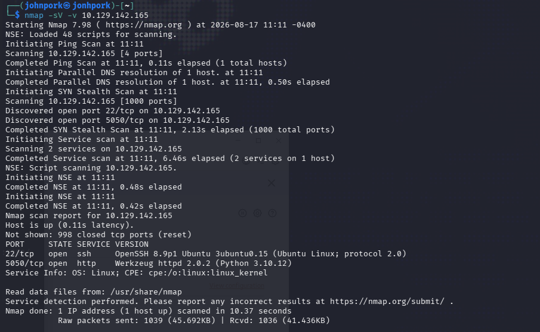

Two ports open: 22 running OpenSSH 8.9p1 (Ubuntu), and 5050 running Werkzeug httpd 2.0.2 (Python 3.10.12) — a Flask development server. Since 22 is a dead end without credentials, the web app on 5050 is the obvious starting point.

### Web Enumeration

The root page is a completely static landing page for "CorpNet — Network Operations Centre," with no links, buttons, or forms to interact with.

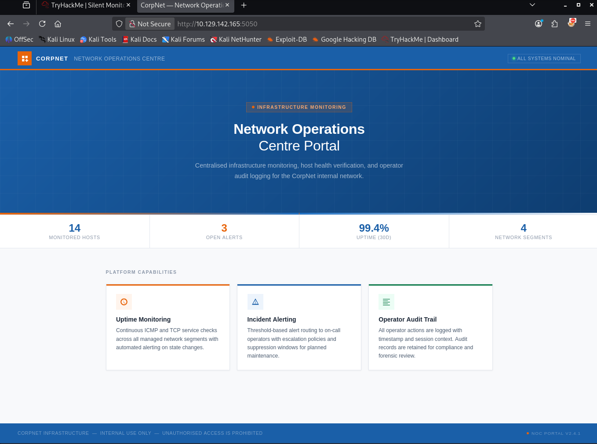

Nothing to click, so I went straight to content discovery with `ffuf` and turned up a hidden `/internal` directory.

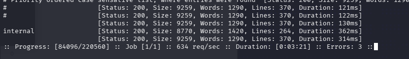

Browsing to `/internal` drops straight into an operator login portal — "Sign In to NOC Portal," restricted to authorized personnel.

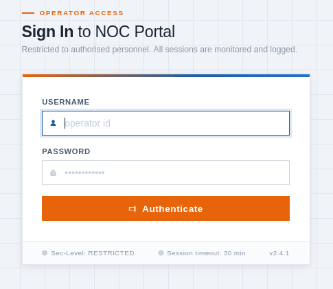

---

## Initial Foothold

### Mapping the Authenticated App

Before touching the login form, I ran a second `ffuf` pass scoped to `/internal/FUZZ` to see what exists behind auth.

```bash
ffuf -w /usr/share/wordlists/dirbuster/directory-list-2.3-medium.txt -t 200 -u http://<target-ip>:5050/internal/FUZZ -fs 0
```

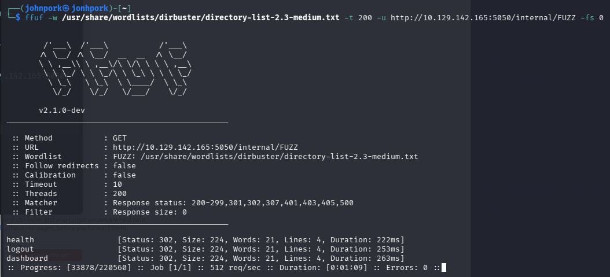

Three endpoints surface: `health`, `logout`, and `dashboard`. With the attack surface mapped, I moved on to manually probing the login form for injection points.

### SQL Injection Authentication Bypass

After a handful of manual payloads, the simplest classic worked — a single-quote comment breakout in the username field that always evaluates true:

```
username=test' OR 1=1-- &password=id1
```

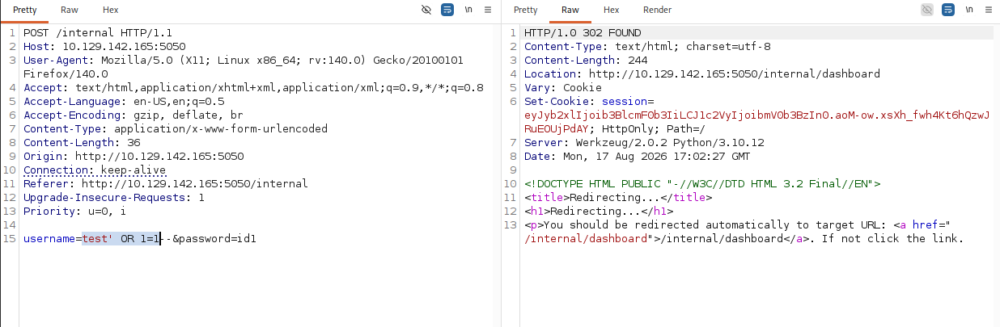

The server returns a 302 redirect straight to `/internal/dashboard` along with a fresh `session` cookie — the login check was bypassed entirely. I decoded the resulting JWT to see what it granted.

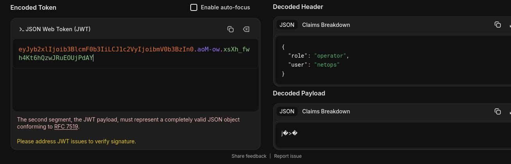

The token carries `"role": "operator"` and `"user": "netops"` — a working NOC operator session with no valid credentials required.

### Exploring the Dashboard

Dropping the session cookie into the browser lands on the live "System Overview" dashboard: 12 hosts online, open alerts, network segments, and a full audit log.

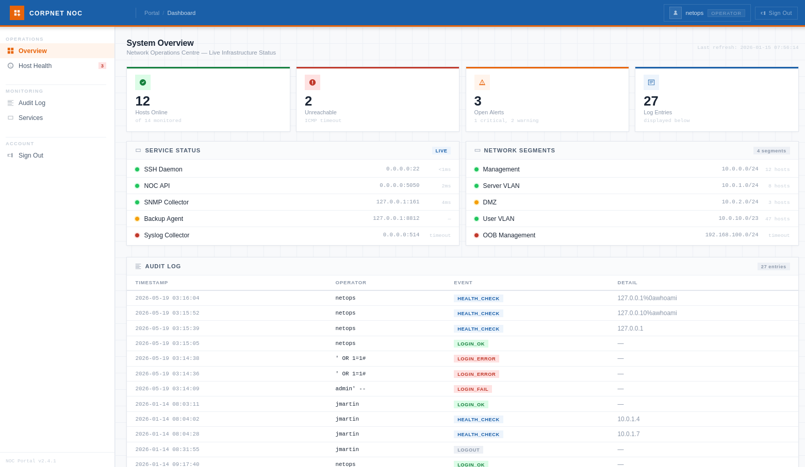

The audit log is a goldmine on its own — it leaks legitimate usernames (`jmartin`, `netops`, and later `svc-mon`) and confirms my own SQLi attempts (`' OR 1=1#`, `admin' --`) landed as `LOGIN_ERROR`/`LOGIN_FAIL` entries right before the successful bypass. More importantly, the **Host Health** section exposes a probe feature that lets an operator ping arbitrary hosts — a very likely attack surface.

### Host Health Probe → Command Injection

The probe form accepts a target and runs it through what's clearly a `ping` wrapper on the backend.

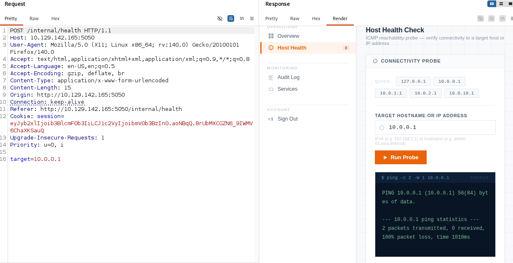

Testing showed the field passes straight into `ping -c 2 -W 1 <target>`. Appending a second command like `id` was outright rejected by server-side validation.

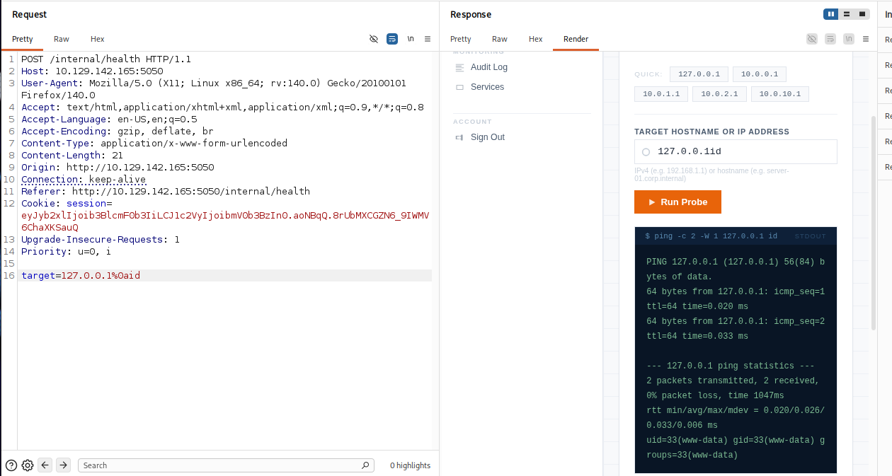

To get past the validator, I swapped the usual shell metacharacters for a URL-encoded newline (`%0a`), which the validator doesn't account for but the shell still treats as a command separator:

```
127.0.0.1%0aid
```

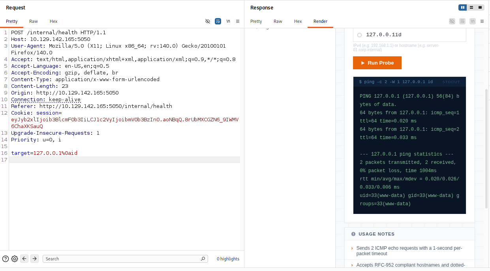

The response confirms code execution as `www-data` (`uid=33(www-data) gid=33(www-data)`). With RCE confirmed, I used the same injection point to hunt for anything useful on disk before attempting a full reverse shell.

### Extracting Credentials

A `cat` of a `secret.config` file turned up the application's backup-agent credentials in plaintext:

```
127.0.0.1%0acat secret.config
```

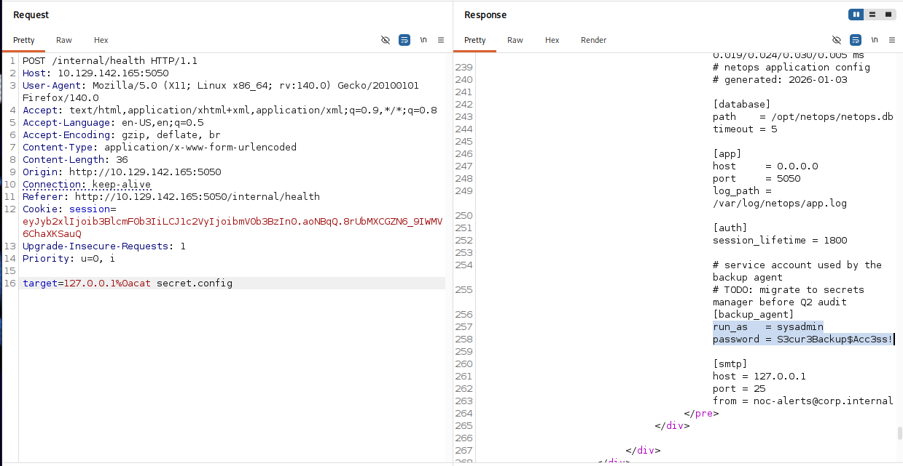

```
[backup_agent]
run_as   = sysadmin
password = S3cur3Backup$Acc3ss!
```

The config even has a `TODO: migrate to secrets manager before Q2 audit` comment sitting right above the plaintext password — never actioned.

### SSH Access

Port 22 was the only other exposed surface, so I tried the leaked credentials there directly. They worked, landing a shell as `sysadmin` and the user flag.

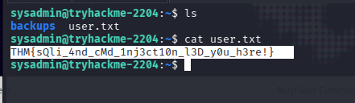

**User Flag:** `THM{sQli_4nd_cMd_1nj3ct10n_l3D_y0u_h3re!}`

---

## Privilege Escalation

### Locating the KeePass Database

To confirm the local account landscape before digging further:

```bash
cat /etc/passwd | grep bash
```

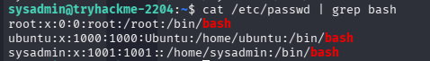

Enumeration under `ubuntu`'s home didn't turn up anything useful, so I stepped back and revisited `sysadmin`'s own directories — specifically a `backups` folder I'd initially skipped over. Inside was `infrastructure.kdbx`, a KeePass password database, encrypted and unreadable directly.

I pulled it back to my attacking machine over a quick HTTP server:

```bash
python3 -m http.server 8081
```

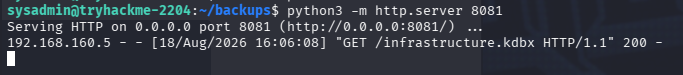

### Cracking the Database

First attempt was a targeted brute force with `keepass4brute` against a custom, AI-generated wordlist built from context clues in the room (hostnames, technology, theming) — no luck.

```bash
./keepass4brute.sh infrastructure.kdbx wordlist
```

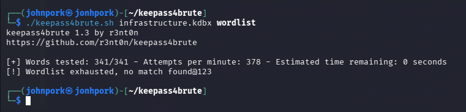

I converted the database to a crackable hash format and handed it to John the Ripper instead, this time against a more generic password list:

```bash
keepass2john infrastructure.kdbx > kdbx.hash
./john kdbx.hash --wordlist=password.lst
```

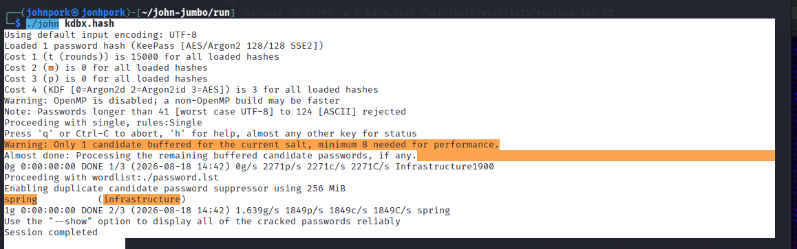

The master password cracked to `spring`.

### Root Access

With the master password in hand, I opened the vault through the KeePassXC CLI and pulled the stored root credentials directly:

```bash
keepassxc-cli show /home/johnpork/infrastructure.kdbx "Root User Password - Sensitive" -s
```

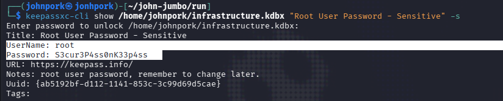

```
UserName: root
Password: S3cur3P4ss0nK33p4ss
```

Switched users and grabbed the final flag.

```bash
su - root
cat root.txt
```

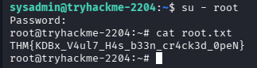

**Root Flag:** `THM{KDBx_V4ul7_H4s_b33n_cr4ck3d_0peN}`


